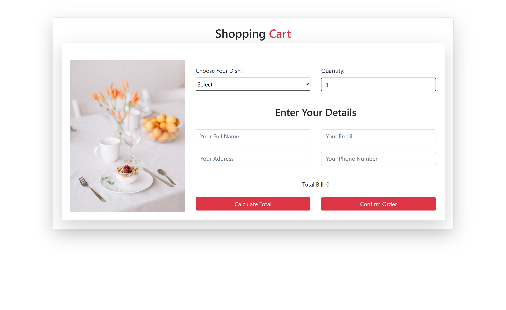
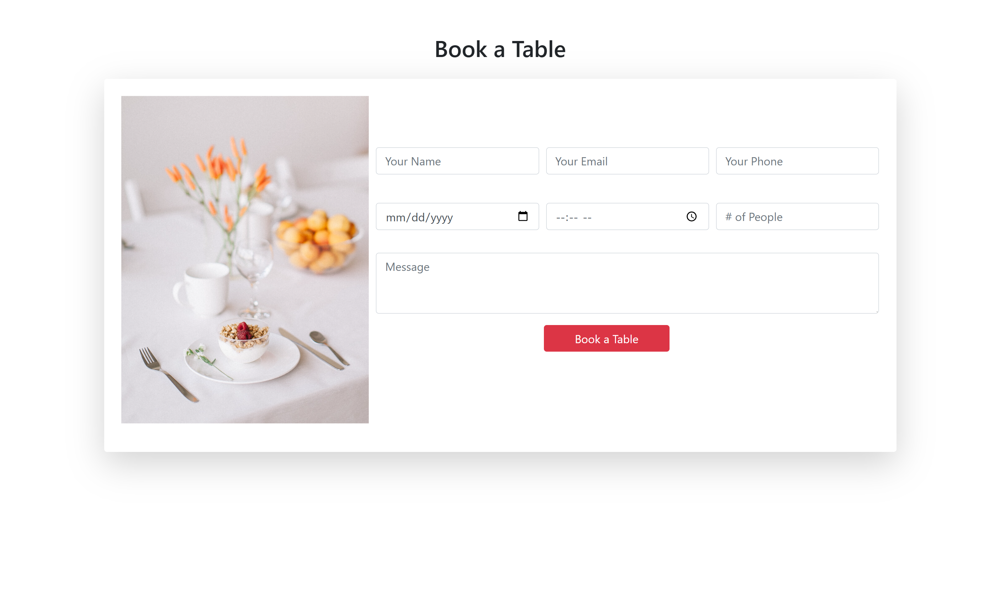

# Dish & Dine Restaurant Website

## Project Overview

Dish & Dine is a responsive restaurant website developed using HTML, CSS, JavaScript, Bootstrap, and PHP. The project provides a modern and user-friendly interface where customers can explore the restaurant menu, reserve tables, place online orders, browse the gallery, and contact the restaurant.

## Features

- Responsive design for desktop and mobile devices
- Interactive homepage
- Online food ordering
- Table reservation system
- Shopping cart
- Restaurant menu
- Gallery section
- Contact form
- PHP backend for order and reservation handling

## Technologies Used

- HTML5
- CSS3
- JavaScript
- Bootstrap
- PHP

---

# Project Screenshots

## Full Website


---

## Menu Section


---

## Shopping Cart



---

## Table Reservation



---

## Project Structure

```
Dish-and-Dine-Restaurant-Website/
│
├── images/
├── Project.html
├── Table.html
├── shoppingCart.html
├── orderOnline.html
├── thanku.html
├── book_table.php
├── order_now.php
├── README.md
```

## How to Run

1. Download or clone the repository.
2. Open `Project.html` in your browser.
3. For PHP functionality (table reservation and order processing), run the project using XAMPP or any local PHP server.

## Future Improvements

- User authentication
- Online payment integration
- Admin dashboard
- Order history
- Database integration
- Food search and filtering

## Author

**Nisha Lohana**

Computer Science Graduate | Web Developer | UI/UX Designer | 3D Modeller
